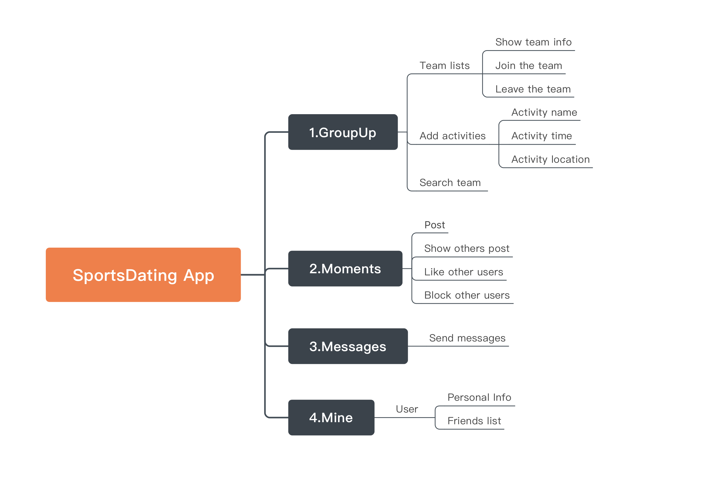
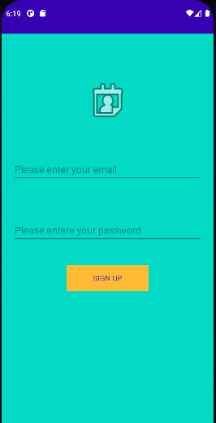
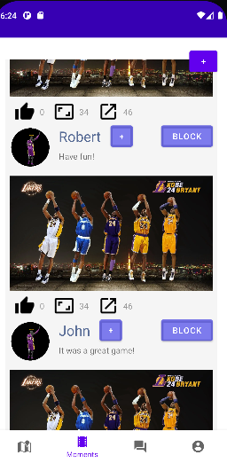
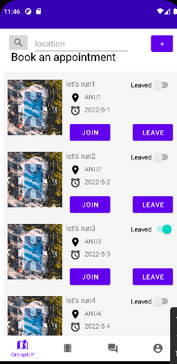
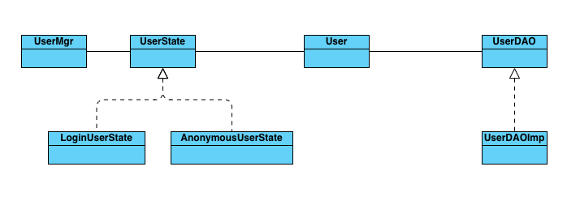
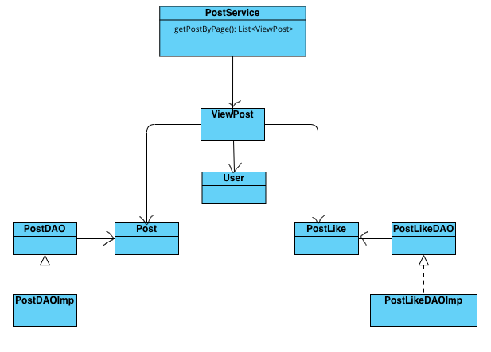
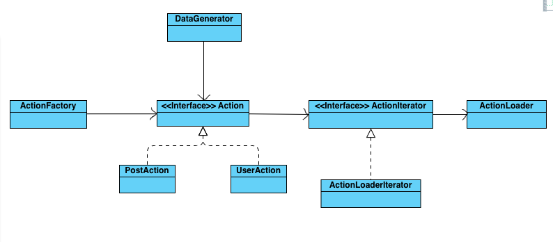

# [SportsDating] Report

## Table of Contents

1. [Team Members and Roles](#team-members-and-roles)
2. [Summary of Individual Contributions](#summary-of-individual-contributions)
3. [Conflict Resolution Protocol](#conflict-resolution-protocol)
4. [Application Description](#application-description)
5. [Application UML](#application-uml)
6. [Application Design and Decisions](#application-design-and-decisions)
7. [Summary of Known Errors and Bugs](#summary-of-known-errors-and-bugs)
8. [Testing Summary](#testing-summary)
9. [Implemented Features](#implemented-features)
10. [Surprise-Refactoring](#Surprise - refactor)
11. [Team Meetings](#team-meetings)

## Team Members and Roles

I contribute 30% of the code. Here are my contributions:*
All lines in DataGenerator Module: 
1.	Action.java, ActionFactory.java, PostAction.java, UserAction.java
2.	ActionIterator.java, ActionLoader.java
3.	ActionType.java, DataGenerator.java

All lines in Post Module:
1.	Post.java, PostLike.java, ViewPost.java, PostService.java, PostTree.java
2.	PostDAO.java, PostDAOImp.java, PostLikeDAO.java, PostLikeDAOImp.java

All lines in User Module:
1.	User.java, UserDAO.java, UserDAOImp.java, AnonymousUserState.java, LoginUserState.java, LoginUserState.java, UserErrorCode.java, UserMgr.java

All lines in Utils:
1.	FileUtil.java, JSONUtil.java, LocalStorageUtil.java, StringUtil.java

Line58-Line68 in PostActivity.java
Methods implementations in MomentPostAdapter.java

## Conflict Resolution Protocol

*If we can not come up with a solution to the conflicts after discussion, we vote and follow the majority's decision. If there is a tie in the vote, the group leader will solve the problem which also means group leader's voting weigh is slightly higher than group membersw.*

## Application Description

*1.Product Orientation:*

*To provide a convenient and convenient sports dating platform for the majority of sports enthusiasts, users can not only meet more like-minded people, but also share the fun of sports...*

*2.Product Strategy：*

*The group up function can quickly find the right teammates, which solves the pain point of the user team sports can not find the teammates....*

**Application Use Cases and or Examples**

*[Provide use cases and examples of people using your application. Who are the target users of your application? How do the users use your application?]*

*3.User profile：*
 *The app is used for young people who love group sports, such as people who love basketball. Most users have no right partner when they want to play, hoping to make friends with the same hobby on the platform*

*Here is a map navigation application example*

*Targets Users: Those basketball player who wants to find some good teammate to play with*

* *Users can find nearby basketball teams and the application can give recommendations.*

*List all the use cases in text descriptions or create use case diagrams. Please refer to https://www.visual-paradigm.com/guide/uml-unified-modeling-language/what-is-use-case-diagram/ for use case diagram.*

## Application UML

## Application Design and Decisions

*Please give clear and concise descriptions for each subsections of this part. It would be better to list all the concrete items for each subsection and give no more than `5` concise, crucial reasons of your design. Here is an example for the subsection `Data Structures`:*

*I used the following data structures in my project:*

1. *RBTree*

   * *Objective: It is used for storing posts and activities.*

   * *Locations: line 12 in Tree.java, line 9 in PostTree.java, etc.*

   * *Reasons:*

     * *It is very efficient to insert, find, and delete with a time complexity O(log_n)*

2. *List*

   * *Objective: It is used for getting all the information in the tree.*

   * *Locations: line 60 in PostDAOImp.java etc.*

   * *Reasons:*

     * *We need to extract data from tree*

3. *Set*

   * *Objective: It is used for getting not duplicated information.*

   * *Locations: line 39 in PostService.java etc.*

   * *Reasons:*

     * *We need find unique data*

**Data Structures**
1. LinkedList
2. ArrayList
3. HashMap
4. HashSet
5. RB-Tree

**Design Patterns**
1. Iterator
Objective: It is used for iterating over the user/post data.
Locations: ActionLoader.java, ActionIterator.java
Reasons:
To maintain the single responsibility principle, ActionLoader is used
to fetch and store the simulated records, for example, user or post*.
ActionIterator help with the management of iterate the content fetched 
from the file.

2. Singleton
Objective: It is to guarantee there's only one access to a certain class
Locations: UserMgr.java, UserDAOImp.java etc.
Reasons:
UserMgr.java is used to maintain current user status, there is always only one logged user.

3. Factory
Objective: Factory provides an interface for creating objects for a superclass, 
but clients to decide the type of objects that will be created.
Locations: ActionFactory.java
Reasons:
In data stream part, there are now two types of actions, User creation and Post creation,
there might be other streams in the future, such as activities, follow/block users, using
factory design pattern can decouple the logic with the actual classes responsible for the 
action, this can avoid changing the existing file, we can create an independent
sub-classes of Action.java everytime there is new action type is required.

4. DAO 
Objective: To separate the business layer with the persistent layer
Locations: UserDAO.java, PostDAO.java, SportActivityDAO.java, PostLikeDAO.java
Reasons:
The use of DAO helps to keep model classes decoupled from the persistent layer(file 
read and write in this project).

**Grammar(s)**

*The grammar is used to parse information user input when they search. User could input with headers or only with text.*
*The grammar extract ID and activity from user input text and headers and output them as map in the function "output".*
*The advantage of this grammar is that it can extract key information in the user input and narrow down search scope.*
*The Grammar also support user input different headers like "id:" to narrow down search scope even more.*

  *Production Rules*  
&lt;exp> ::= &lt;title> &lt;header> &lt;header_info> &lt;exp> | &lt;title> | &lt;header> &lt;header_info> &lt;exp>
 
&lt;title> ::= &lt;activity> &lt;output> | &lt;output> | &lt;output> &lt;activity> &lt;output> | &lt;output> &lt;activity>
 
 &lt;header_info> ::= &lt;activity> | &lt;location> | &lt;time>
 
&lt;activity> ::= &lt;output>
 
&lt;location> ::= &lt;output>
 
&lt;time> ::= &lt;output>

I design the grammar based on what we want to search. So we want to search activity, location and time. So I extract thses information to the output.

*If there are several grammars, list them all under this section and what they relate to.*

**Tokenizer and Parsers**

*Use tokenisers and parsers to handle user search input, extract key information to narrow down search scope*
*We can narrow down search scope so that we can search a lot of information in the smaller tree instead of the whole tree*

**Surpise Item**

**Other**

## Summary of Known Errors and Bugs

*Here is an example:*

1. *Bug 1:*

- *getPostByPage(int page) in PostService.java*
- if(startIndex <=0 || startIndex > postList.size()-1 || endIndex > postList.size()){
-	            return null;
- }
- When startIndex is zero, no posts were returned, it’s fixed by changing to startIndex < 0.   

2. *Bug 2:*

- Once Timer is cancelled, it cannot be scheduled again, to schedule another TimerTask, we need to create a new object for Timer
- The cause of this bug is crash of the app.

3. *Bug 3:*

- move finish() out from navigateTo() method, because finish() will prevent users returning back to login page from register page which is 
- unreasonable. Instead, executing finish() after successfully login makes sense.

4. *Bug 4:*

- getPostByPage(int page) in PostService.java
-  will generate error when endIndex is greater than the nonBlockedPosts size. Fix this with the following modification:
-	        if(endIndex > nonBlockedPosts.size())
-	            endIndex = nonBlockedPosts.size();

## Testing Summary

*Here is an example:*

*Number of test cases: ...*

*Code coverage: ...*

*Types of tests created: ...*

*Please provide some screenshots of your testing summary, showing the achieved testing coverage. Feel free to provide further details on your tests.*
Testing:
UserMgrTest
Number of test cases: 6
Code coverage: Testing all functions related to current user, including user login and logout,  get username, user images, friends list, block list
Types of tests created: unit tests, integration test
Integration tests were performed on simulator. By registering and login in on emulator, check the UserData file content, make sure the process is correct.

UserDAOTest
Number of test cases: 8
Code coverage: Testing all functions inside UserDAO, including add, delete, find users, adding friends/blocks, get blocks/friends list
Types of tests created: unit tests
 

PostTest
Number of test cases: 7
Code coverage: Testing all functions inside PostDAO, including get all posts, find specific post by id/name, 
Types of tests created: unit tests, integration test
Integration tests were performed on simulator. By operating the buttons and checking the file content dynamically changing can make the test easier.
 
PostLikeTest
Number of test cases: 3
Code coverage: Testing all functions inside PostLikeDAO, including if user liked post, like counts of a post and user likes a post. 
Types of tests created: unit tests, integration test
This part requires more user interaction, so tests on the emulator by clicking like/follow/block button and check the outlook of the buttons, also verify that postLike file content was correctly written.
 
PostServiceTest
Number of test cases: 1
Code coverage: Testing fetching posts by page number inside PostService 
Types of tests created: unit tests
 
DataGeneratorTest
Number of test cases: 2
Code coverage: Testing starting and stopping the data simulation 
Types of tests created: unit tests

ParserTest
Number of test cases: 4
Code coverage: 96%, cover Parcer and Token and Tokenizer
Types of tests created: unit tests

RBTreeTest
Number of test cases: 16
Code coverage: 93% cover RBTree
Types of tests created: unit tests

TokenizerTest
Number of test cases: 5
Code coverage: 89%, cover Token and Tokenizer
Types of tests created: unit tests
 

## Implemented Features

*Here is an example:*

*Privacy*

1. *Featue 1:Users interact with Search page
**Description**:Search functionality can handle partially valid and invalid search queries.
**What the feature entails**:When the search imageButton is clicked,start the Search Activity,Where user can type uid or sportsActivity name to search for information.if uid is typed,the user information will show on the search.xml,if sportsActivity name is clicked,it will show the team information of that sportsActivity name.
**Feature relevance**: Improved Search. 
**Suggested Difficulty Level**:(medium).

2. *Feature 2:Users interact with Search page
**Description**:UI must have portrait and landscape layout variants as well as support for different screen sizes.
**What the feature entails**:In order to make the UI resonable,good looking and follow the logic of Users,we designed 12 pages(activities),the UI is user-friendly,we also use lots of widgets and Fragment to make UI suit different phone and Ipad .
**Feature relevance**: UI Design and Testing. 
**Suggested Difficulty Level**:(easy).

3. *Feature 3: Users data are stored in csv,json files
**Description**:Read data instances from multiple local files in different formats.
**What the feature entails**:Each time we search,post,create new team,follow or block someone,when it is need to be show on the xml files ,we will read data from different files.
**Feature relevance**: Greater Data Usage, Handling and Sophistication. 
**Suggested Difficulty Level**:(easy).

4. *Feature 4:images are used basicly on user post page.
**Description**:User profile activity containing a media file (image)
**What the feature entails**:When the post button is clicked,the image our user post will be stored first,then show on Moment module.
**Feature relevance**: Greater Data Usage, Handling and Sophistication.
**Suggested Difficulty Level**:(easy).

5. *Feature 5:report on post page.
**Description**: Report viewer.
**What the feature entails**users can see the total likes of there post.
**Feature relevance**: Greater Data Usage, Handling and Sophistication.
**Suggested Difficulty Level**:(medium).

6. *Feature 6: 
**Description**:The ability to micro-interact with items in your app.
**What the feature entails**:people can like a post on Moment module.
**Feature relevance**: User Interactivity. 
**Suggested Difficulty Level**:(easy).

7. *Feature 7: 
**Description**:The ability to ‘follow’ users.
**What the feature entails**:When user are scrolling down on moment page,if he/she clicked the button behind other user's name,then this Specific user will be added to follow list.
**Feature relevance**: User Interactivity. 
**Suggested Difficulty Level**:(medium).

8. *Feature 8: 
**Description**:Provide users with the ability to ‘block’ things.
**What the feature entails**:When the block switch button is clicked on moment page,you can not see anything of this user.
**Feature relevance**: Privacy. 
**Suggested Difficulty Level**:(medium).

9. *Feature 9: 
**Description**:Your app may implement a chain of action/steps (at least 3 steps) to follow up on a process required by your app's theme.
**What the feature entails**:Users can create an team activity.step1:typed the activity's name, sports type,time and location. step2:this team activity will shows on the groupup page,step3:once the team activity is on group up page,other users can join the team by click on join button.step4:users who joined this team activity can clicked the leave button to leave this activity).
**Feature relevance**: Creating Processes. 
**Suggested Difficulty Level**:(hard).

10. *Feature 10: 
**Description**:Deletion method of either a Red-Black Tree, AVL tree or B-Tree data tructure. The
deletion of nodes must serve a purpose within your application.
**What the feature entails**: We use red black tree to store posts. So when delete post the complexity is O(log_ n).
**Feature relevance**: Data Structures. 
**Suggested Difficulty Level**:(hard).

*Firebase Integration*
1. *Feature 1: Use Firebase to implement ... . (easy)*
2. *Feature 2: Use Firebase to persist ... .(medium)*

*List all features you have completed in their separate categories with their difficulty classification. If they are features that are suggested and approved, please state this somewhere as well.*

## Surprise - refactor
(i) identify at least four existing code smells in your code. For each code smell, list all relevant git commits, files and line numbers (up to 0.5 marks)

1. Large Class 
File: DataGenerator.java is a large class containing too much code.  Line69-87
Git commit: May 7, 2022 at 8:47:26 PM GMT+10
Commit msg: DataStream module
2. Switch Statements 
File: DataGenerator.java switch statements were used in dataStream() method. Line57-65
Git commit: May 7, 2022 at 8:47:26 PM GMT+10
Commit msg: DataStream module
3. Long Method 
File: app/src/main/java/com/example/sportsdating/post/service/PostService.java Line37-83
Date: May 8, 2022 at 4:40:56 PM GMT+10
Commit msg: fix endIndex bug in PostService.java
Method “getPostByPage()” is too long, making it hard to understand.
4. Data Class
There are several data classes which have only setter and getter for fields insides. 
File: app/src/main/java/com/example/sportsdating/user/model/User.java
Date: May 5, 2022 at 10:24:42 PM GMT+10
rename userProfilePic to userImg, rename getUserMgr to getInstance
File: app/src/main/java/com/example/sportsdating/post/model/Post.java
Date: April 21, 2022 at 9:21:19 AM GMT+10
"Post Pojo" commit, removed extra activity classes

(ii) correct at least two existing implementation issues identified in (i). For each correction, list all relevant git commits, files and line numbers (up to 0.5 marks) 

1.	Correction for Large Class in DataGenerator.java   Line69-87
Commit Date: May 10, 2022 at 5:40:01 PM GMT+10
Refactoring DataGenerator module
Commit Date: May 19, 2022 at 10:31:45 PM GMT+10
DataGenerator, fix issues
app/src/main/java/com/example/sportsdating/datagenerator/action/Action.java
app/src/main/java/com/example/sportsdating/datagenerator/action/PostAction.java
app/src/main/java/com/example/sportsdating/datagenerator/action/UserAction.java

2.	Correction for Switch statements in DataGenerator.java  Line57-65
Correction for Large Class in DataGenerator.java   Line69-87
Commit Date: May 10, 2022 at 5:40:01 PM GMT+10
Refactoring DataGenerator module
Commit Date: May 19, 2022 at 10:31:45 PM GMT+10
DataGenerator, fix issues
app/src/main/java/com/example/sportsdating/datagenerator/action/ActionFactory.java

(iii) provide a detailed description of the existing code smells identified in your code and explain how did you solve the implementation issues and why previous solutions were not suitable and why the new ones are. In case you are unable to correct the smells found in your code, explain why it was not possible. (up to 1 mark)

Solution for large class problem in DataGenerator module: Take out the codes doing different kinds of operations(create users, posts, etc.), and created an Interface Action.java, which defines “performAction()” method. Subclasses of this interface can implements this method based on their own behavior, such as UserAction.java, PostAction.java. This makes it easy to expand in the future when there is any other actions need to be added. For example, Activity creation can be added by adding an extra subclass ActivityAction.java. This does not require any change in client code making it decoupled and flexible to change.

Solution for switch statement was resolved by Action interface and applying Factory Design pattern. ActionFactory.java is created as the factory method generating the appropriate actions according to the parameters passed from client(DataGenerator.java). This enables client(DataStream) to decide which action to perform by passing the ActionType to createAction() method. Clients need very little change whenever there is any new actions are added.

## Team Meetings

*Here is an example:*

- *[Team Meeting 1](./MeetingTemplate.md)*
- ...

*Either write your meeting minutes here or link to documents that contain them. There must be at least 4 team meetings. Note that you must commit your minute meetings shortly after your meeting has taken place (e.g., within 24h), otherwise your meeting minute will not be accepted.*
